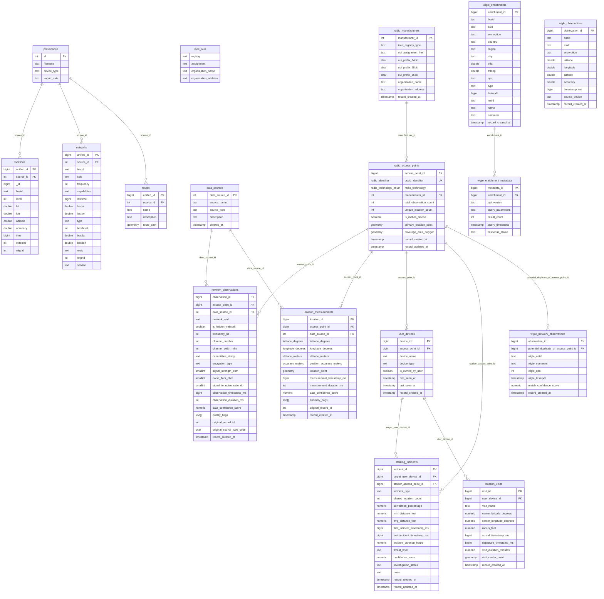
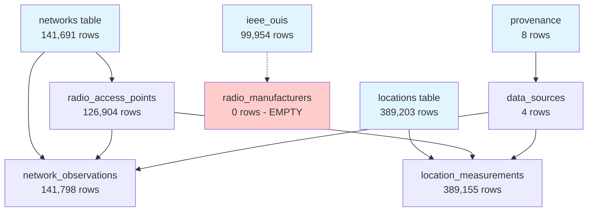

# ShadowCheck Current Schema - Entity Relationship Diagram

## Current Schema Relationships (Mermaid ERD)

## Data Flow Analysis

### Legacy → Normalized Transformation

### Problem Areas Identified

1. **Data Loss in Transformation**:
   - `networks` (141,691) → `radio_access_points` (126,904) = **10.4% loss**
   - `locations` (389,203) → `location_measurements` (389,155) = **0.01% loss**

2. **Missing Data Population**:
   - `ieee_ouis` (99,954) should populate `radio_manufacturers` (0)
   - Empty security tables suggest incomplete implementation

3. **Inconsistent Relationships**:
   - WiGLE integration tables disconnected from main schema
   - No clear path from legacy to analytics tables

## Schema Issues Summary

| Issue Type | Table(s) Affected | Impact |
|------------|------------------|---------|
| **Empty Tables** | `radio_manufacturers`, `stalking_incidents`, `location_visits` | Missing functionality |
| **Data Duplication** | `locations`/`location_measurements`, `networks`/`radio_access_points` | Storage waste, sync issues |
| **Naming Confusion** | `network_observations` | Unclear purpose |
| **Broken Relationships** | `radio_manufacturers` FK constraint | Data integrity issues |
| **Inconsistent Types** | Mixed timestamp formats | Query complexity |
| **Missing Constraints** | Signal strength, coordinates | Data quality issues |

This diagram illustrates the current state complexity and identifies areas requiring refactoring attention.